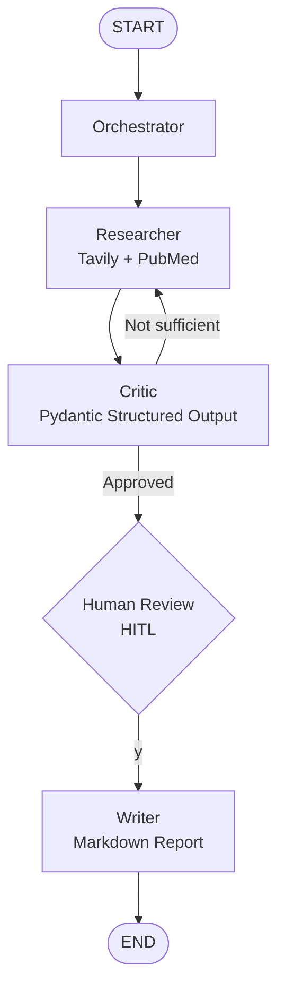

# 🧬 LangGraph Clinical Research Orchestrator

> Multi-Agent AI system for clinical evidence surveillance, built with LangGraph, DeepSeek and Tavily.

## Architecture



## Agents

| Agent | Role |
|-------|------|
| **Orchestrator** | Initializes state and coordinates flow |
| **Researcher** | Searches web via Tavily + PubMed mock |
| **Critic** | Evaluates data quality with structured output |
| **Writer** | Generates final Markdown clinical report |

## Key Technical Decisions

- **LangGraph over CrewAI**: StateGraph gives explicit control over edges and interrupts
- **`operator.add` on `research_data`**: Ensures append-only accumulation across revisions
- **`interrupt_before=["writer"]`**: Human approves before report generation
- **DeepSeek via OpenAI-compatible API**: Cost-efficient, drop-in replacement

## Setup

```bash
git clone https://github.com/Armandogith/langgraph-research-orchestrator.git
cd langgraph-research-orchestrator
pip install -r requirements.txt
cp .env.example .env  # Add your keys
python main.py
```

## Stack
`LangGraph` · `LangChain` · `DeepSeek` · `Tavily` · `Pydantic` · `Python 3.11`