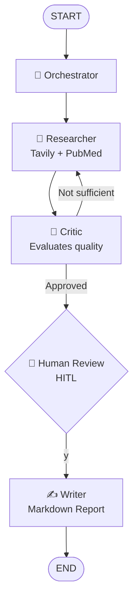

# 🧬 LangGraph Clinical Research Orchestrator

> Multi-Agent AI system for clinical evidence surveillance.  
> Built with LangGraph, DeepSeek and Tavily.

## How it works

You ask a complex medical question. A network of AI agents researches, critiques, 
and only writes the report when the data quality is approved — by both the Critic 
agent and a human reviewer.

## Agent Flow



## Agents

| Agent | Role |
|-------|------|
| **Orchestrator** | Initializes state and coordinates the flow |
| **Researcher** | Searches web via Tavily + PubMed mock |
| **Critic** | Evaluates data quality — loops back if insufficient |
| **Writer** | Generates final structured clinical report |

## Key Technical Decisions

- **LangGraph over CrewAI** — explicit control over edges, state and interrupts
- **`operator.add` on `research_data`** — append-only accumulation across revisions
- **`interrupt_before=["writer"]`** — human approves before report generation
- **DeepSeek via OpenAI-compatible API** — cost-efficient drop-in replacement

See [architecture.md](./architecture.md) for full decision rationale.

## Example Output

The file [`clinical_report.md`](./clinical_report.md) was generated by the system  
using the query:  
> *"Latest evidence on semaglutide for obesity treatment in CKD patients"*

## Setup

```bash
git clone https://github.com/Armandogith/langgraph-research-orchestrator.git
cd langgraph-research-orchestrator
pip install -r requirements.txt
cp .env.example .env  # add your keys
python main.py
```

## Environment Variables

```env
DEEPSEEK_API_KEY="sk-..."
TAVILY_API_KEY="tvly-..."
```

## Stack

`LangGraph` · `LangChain` · `DeepSeek` · `Tavily` · `Pydantic` · `Python 3.14`